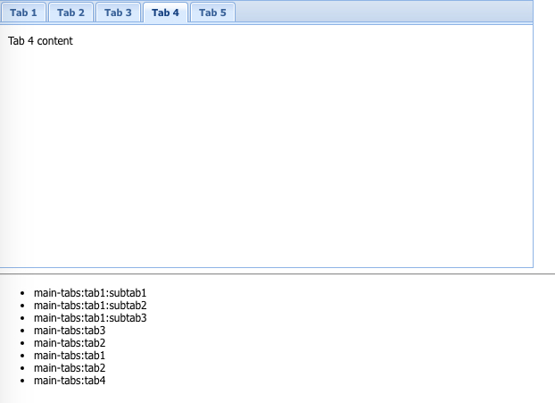

JavaScript ExtJS History Demo
=============================

`Ext.History`就像是`window.history`以及`window.location`与Ext组件之间的桥梁。
当Ext组件的状态发生了变化，可以把能代表当前状态的数据以string的形式传给`Ext.History.add`，
它会把这个状态字符串添加到`window.location`的hash上，同时也会加入到`window.history`中。

当`window.location`发生变化时，这个变化可以通过`Ext.History`的`change`事件传播给监听了该事件的组件，
它们可以拿到当前的token（也就是`window.location.hash`）从中解析出状态数据，改变自己。

我开始以为`Ext.History`是一个栈，会保留所有变化历史，后来发现它只保存了当前状态，历史都交给`window.history`了。

所以我们没有直接的办法从`Ext.History`拿到历史记录，我只能监听`change`事件，手动记录并显示。

```
open index.html
```



Resources
---------

- ext cdn: <https://cdnjs.com/libraries/extjs>
